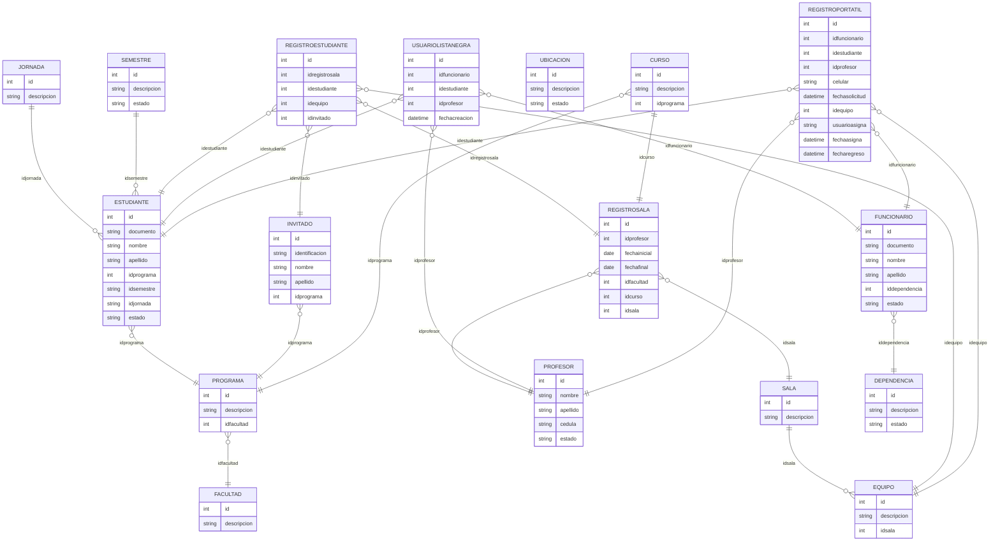

# Diagrama de base de datos. Modulo salas y protatil

```mermaid
erDiagram
    ESTUDIANTE }o--|| PROGRAMA : idprograma
    JORNADA ||--o{ ESTUDIANTE : idjornada
    SEMESTRE ||--o{ ESTUDIANTE : idsemestre

    ESTUDIANTE {
        int id
        string documento
        string nombre
        string apellido
        int idprograma
        string idsemestre
        string idjornada
        string estado
    }
    PROFESOR {
        int id
        string nombre
        string apellido
        string cedula
        string estado
    }
    INVITADO }o--|| PROGRAMA : idprograma
    INVITADO {
        int id
        string identificacion
        string nombre
        string apellido
        int idprograma
    }
    SALA ||--o{ EQUIPO : idsala
    SALA {
        int id
        string descripcion
    }
    EQUIPO {
        int id
        string descripcion
        int idsala
    }
    REGISTROSALA }o--|| PROFESOR : idprofesor
    REGISTROSALA }o--|| SALA : idsala
    REGISTROSALA {
        int id
        int idprofesor
        date fechainicial
        date fechafinal
        int idfacultad
        int idcurso
        int idsala
    }
    REGISTROESTUDIANTE }o--|| ESTUDIANTE : idestudiante
    REGISTROESTUDIANTE }o--|| REGISTROSALA : idregistrosala
    REGISTROESTUDIANTE }o--|| EQUIPO : idequipo
    REGISTROESTUDIANTE }o--|| INVITADO : idinvitado
    REGISTROESTUDIANTE {
        int id
        int idregistrosala
        int idestudiante
        int idequipo
        int idinvitado
    }
    PROGRAMA }o--|| FACULTAD : idfacultad
    PROGRAMA {
        int id
        string descripcion
        int idfacultad
    }
    JORNADA {
        int id
        string descripcion
    }
    FACULTAD {
        int id
        string descripcion
    }
    CURSO ||--|| REGISTROSALA : idcurso
    CURSO }o--|| PROGRAMA : idprograma
    CURSO {
        int id
        string descripcion
        int idprograma
    }
    SEMESTRE {
        int id
        string descripcion
        string estado
    }
    DEPENDENCIA {
        int id
        string descripcion
        string estado
    }
    UBICACION {
        int id
        string descripcion
        string estado
    }
    FUNCIONARIO }o--|| DEPENDENCIA : iddependencia
    FUNCIONARIO {
        int id
        string documento
        string nombre
        string apellido
        int iddependencia
        string estado
    }
    USUARIOLISTANEGRA }o--|| FUNCIONARIO : idfuncionario
    USUARIOLISTANEGRA }o--|| ESTUDIANTE : idestudiante
    USUARIOLISTANEGRA }o--|| PROFESOR : idprofesor
    USUARIOLISTANEGRA {
        int id
        int idfuncionario
        int idestudiante
        int idprofesor
        datetime fechacreacion
    }
    REGISTROPORTATIL }o--|| FUNCIONARIO : idfuncionario
    REGISTROPORTATIL }o--|| ESTUDIANTE : idestudiante
    REGISTROPORTATIL }o--|| PROFESOR : idprofesor
    REGISTROPORTATIL }o--|| EQUIPO : idequipo
    REGISTROPORTATIL {
        int id
        int idfuncionario
        int idestudiante
        int idprofesor
        string celular
        datetime fechasolicitud
        int idequipo
        string usuarioasigna
        datetime fechaasigna
        datetime fecharegreso
    }
```
