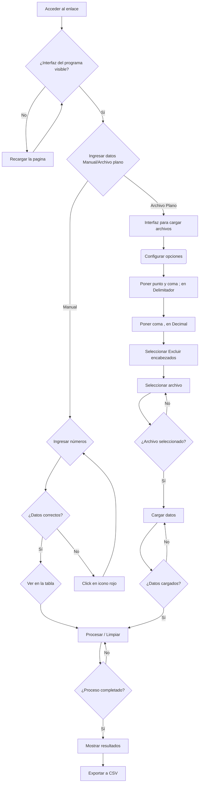

# Diagrama de flujo del proceso

```mermaid
graph TD
A[Acceder al enlace] --> B{¿Interfaz del programa visible?}
B -- No --> K[Recargar la pagina]
B -- Sí --> L{Ingresar datos Manual/Archivo plano}
L -- Manual -->C{Ingresar números}
L -- Archivo Plano -->M[Interfaz para cargar archivos]
K --> B
C --> D{¿Datos correctos?}
D -- Sí --> E{Ver en la tabla}
D -- No --> F[Click en icono rojo]
F --> C
E --> G[Procesar / Limpiar]
G --> H{¿Proceso completado?}
H -- Sí --> I[Mostrar resultados]
H -- No --> G
I --> J[Exportar a CSV]
M --> N(Configurar opciones)
N --> O[Poner punto y coma ; en Delimitador]
O --> P[Poner coma , en Decimal]
P --> Q[Seleccionar Excluir encabezados]
Q --> R[Seleccionar archivo]
R --> S{¿Archivo seleccionado?}
S -- Sí --> T[Cargar datos]
S -- No --> R
T --> U{¿Datos cargados?}
U -- Sí --> G
U -- No --> T
```
